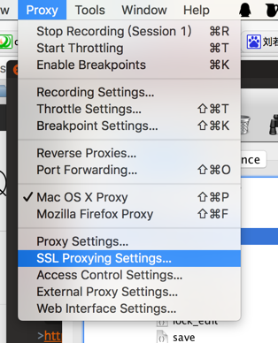
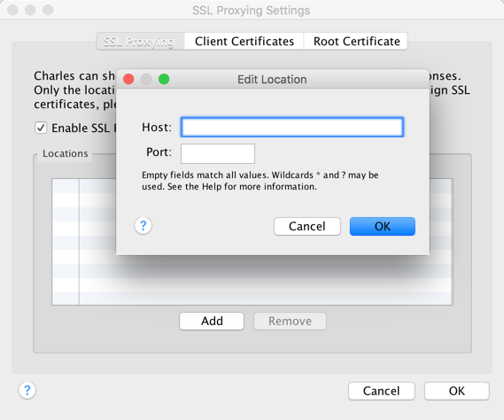

### Charles 抓包准备过程
##### 1，首先要安装Charles，最好有破解补丁；
（下载破解补丁charles.jar，放置路径：右键`替换显示包内容－>Java中的charles.jar文件`）
##### 2,  在手机端设置代理（手动）
（`代理主机名ip是电脑主机的ip，端口选择8888`）
##### 3,  手机端还要安装Charles证书
(下载地址 百度网盘有存)
##### 5，Charles 中设置筛选的域名

>`参考链接`
>http://blog.tingyun.com/web/article/detail/516